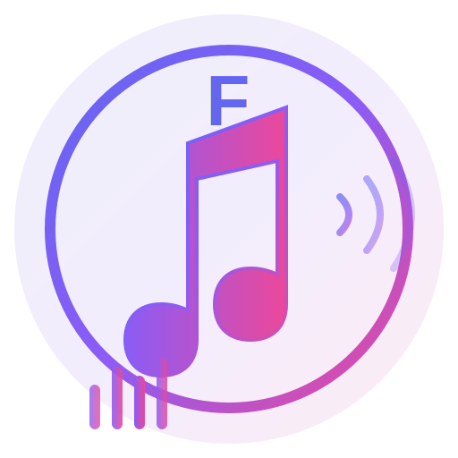
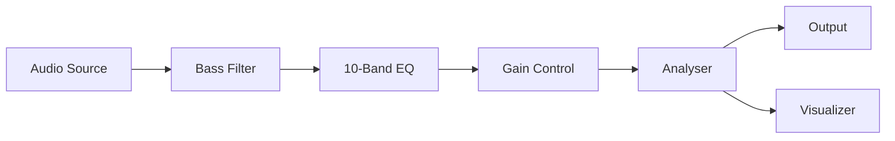

<div align="center">

# 🎵 Fouad Music

### Advanced Music Player with Download & Mixer Controls

[](https://opensource.org/licenses/MIT)
[](https://www.electronjs.org/)
[](https://nodejs.org/)
[](https://github.com)



**A powerful, feature-rich desktop music player with advanced mixer controls, YouTube downloads, and stunning visualizations.**

[Features](#-features) • [Installation](#-installation) • [Usage](#-usage) • [Screenshots](#-screenshots) • [Contributing](#-contributing)

</div>

---

## 📸 Screenshots

<div align="center">


*Clean, modern interface with 10-band equalizer, visualizer, and animated backgrounds*

</div>

## ✨ Features

- 🎵 **Advanced Audio Player** - High-quality playback with professional controls
- 📥 **Download Music** - Download audio from YouTube and other platforms
- 🎚️ **10-Band Equalizer** - Professional-grade frequency control
- 🥁 **Bass Booster** - Enhanced low-frequency response
- 📊 **Audio Visualizer** - Real-time frequency visualization
- 🎨 **Animated Background** - Beautiful gradient waves and particles
- 💾 **Playlist Management** - Save and load your playlists
- ⚡ **Keyboard Shortcuts** - Space to play/pause, Arrow keys to navigate
- 🎯 **Multiple Effects** - Reverb, Echo, and more

## 🚀 Quick Start

```bash
# Clone the repository
git clone https://github.com/yourusername/fouad-music.git

# Navigate to directory
cd fouad-music

# Install dependencies
npm install

# Run the application
npm start
```

## 📦 Installation

### Prerequisites

- **Node.js** v14 or higher ([Download](https://nodejs.org/))
- **npm** or **yarn**
- **Git** ([Download](https://git-scm.com/))

### Detailed Setup

#### 1️⃣ Clone the Repository
```bash
git clone https://github.com/yourusername/fouad-music.git
cd fouad-music
```

#### 2️⃣ Install Dependencies
```bash
npm install
```

#### 3️⃣ Generate Icon (Optional)
```bash
# Install ImageMagick (if not already installed)
sudo apt-get install imagemagick  # Debian/Ubuntu
brew install imagemagick          # macOS

# Convert SVG to PNG
convert -background none -size 512x512 assets/logo.svg assets/icon.png
```

#### 4️⃣ Run the Application
```bash
npm start
```

### 🏗️ Building for Production

Create distributable packages for your platform:

```bash
npm run build
```

**Output** (in `dist/` directory):

| Platform | Format | File |
|----------|--------|------|
| 🐧 Linux | AppImage | `Fouad-Music-1.0.0.AppImage` |
| 🐧 Linux | Debian | `fouad-music_1.0.0_amd64.deb` |
| 🪟 Windows | Installer | `Fouad Music Setup 1.0.0.exe` |
| 🍎 macOS | DMG | `Fouad Music-1.0.0.dmg` |

## Creating Desktop Shortcut (Linux) 🖥️

After building, you can install the app and it will automatically create a desktop entry.

Or manually create a desktop file:

1. Create `~/.local/share/applications/fouad-music.desktop`:
   ```desktop
   [Desktop Entry]
   Name=Fouad Music
   Comment=Advanced Music Player
   Exec=/path/to/fouad-music/fouad-music %U
   Icon=/path/to/fouad-music/assets/icon.png
   Terminal=false
   Type=Application
   Categories=AudioVideo;Audio;Player;
   ```

2. Make it executable:
   ```bash
   chmod +x ~/.local/share/applications/fouad-music.desktop
   ```

## 📖 Usage

### 🎵 Adding Music

| Method | Action |
|--------|--------|
| **Local Files** | Click the 📁 folder icon → Select audio files |
| **YouTube** | Click the ⬇️ download icon → Paste URL → Download |

### 🎮 Player Controls

| Control | Action | Shortcut |
|---------|--------|----------|
| Play/Pause | Toggle playback | `Space` |
| Next Track | Skip forward | `→` or Click ▶▶ |
| Previous Track | Skip backward | `←` or Click ◀◀ |
| Shuffle | Random playback | Click 🔀 |
| Repeat | Loop modes (off/all/one) | Click 🔁 |
| Volume | Adjust 0-100% | Slider |

### 🎚️ Mixer & Effects

#### Volume Control
- Range: **0-100%**
- Real-time adjustment with visual feedback

#### Bass Booster 🥁
- Range: **-10dB to +10dB**
- Frequency: **100Hz**
- Perfect for enhancing low-end punch

#### 10-Band Equalizer 🎛️

| Frequency | Use Case |
|-----------|----------|
| 32Hz, 64Hz | Sub-bass, deep rumble |
| 125Hz, 250Hz | Bass, warmth |
| 500Hz, 1kHz | Midrange, vocals |
| 2kHz, 4kHz | Presence, clarity |
| 8kHz, 16kHz | Brilliance, air |

**Range**: -12dB to +12dB per band

#### Audio Effects
- ✅ **Reverb**: Add space and depth
- ✅ **Echo**: Create delay effects

### ⌨️ Keyboard Shortcuts

| Key | Action |
|-----|--------|
| `Space` | Play/Pause |
| `→` | Next track |
| `←` | Previous track |

## 🎼 Supported Audio Formats

| Format | Extension | Quality |
|--------|-----------|----------|
| MP3 | `.mp3` | ✅ Lossy |
| WAV | `.wav` | ✅ Lossless |
| OGG | `.ogg` | ✅ Lossy |
| FLAC | `.flac` | ✅ Lossless |
| M4A | `.m4a` | ✅ Lossy |
| AAC | `.aac` | ✅ Lossy |
| WebM | `.webm` | ✅ Lossy |

## 📥 Download Sources

| Platform | Status | URL Format |
|----------|--------|------------|
| YouTube | ✅ Supported | `youtube.com/watch?v=...` |
| YouTube Short | ✅ Supported | `youtu.be/...` |
| SoundCloud | 🚧 Coming Soon | - |
| Spotify | 🚧 Coming Soon | - |

## ⚙️ Technical Details

### 🛠️ Built With

| Technology | Version | Purpose |
|------------|---------|----------|
| [Electron](https://electronjs.org/) | 27.0 | Cross-platform desktop framework |
| [Web Audio API](https://developer.mozilla.org/en-US/docs/Web/API/Web_Audio_API) | - | Professional audio processing |
| [ytdl-core](https://github.com/fent/node-ytdl-core) | 4.11.5 | YouTube download functionality |
| [electron-store](https://github.com/sindresorhus/electron-store) | 8.1.0 | Persistent settings storage |
| [Canvas API](https://developer.mozilla.org/en-US/docs/Web/API/Canvas_API) | - | Real-time audio visualization |

### 🔊 Audio Processing Chain



```
Audio Element → Media Source → Bass Filter → EQ[10 Bands] → Gain Node → Analyser → Speakers
                                                                            ↓
                                                                    Visualizer Canvas
```

### 📁 Project Structure

```
fouad-music/
├── 📄 main.js              # Electron main process
├── 📄 renderer.js          # Frontend logic & audio engine
├── 📄 index.html           # UI structure
├── 📄 styles.css           # Styling & animations
├── 📄 package.json         # Dependencies & scripts
├── 📁 assets/
│   ├── 🎨 logo.svg         # App logo
│   └── 🖼️ icon.png         # App icon
├── 📄 README.md            # Documentation
├── 📄 QUICKSTART.md        # Quick start guide
├── 🔧 install-desktop.sh   # Desktop shortcut installer
└── 🔧 generate-icon.sh     # Icon generator
```

## Troubleshooting 🔧

### App won't start
- Ensure Node.js v14+ is installed
- Try deleting `node_modules` and running `npm install` again

### Download not working
- Ensure you have internet connection
- Some videos may be region-restricted
- Try updating ytdl-core: `npm update ytdl-core`

### No sound
- Check system audio settings
- Ensure volume is not muted in the app
- Try restarting the application

## 🤝 Contributing

Contributions are welcome! Here's how you can help:

1. 🍴 **Fork** the repository
2. 🔨 **Create** a feature branch: `git checkout -b feature/amazing-feature`
3. 💾 **Commit** your changes: `git commit -m 'Add amazing feature'`
4. 📤 **Push** to the branch: `git push origin feature/amazing-feature`
5. 🎉 **Open** a Pull Request

### 📋 Development Guidelines

- Write clean, documented code
- Follow existing code style
- Test thoroughly before submitting
- Update documentation as needed

## 🗺️ Roadmap

- [x] Advanced 10-band equalizer
- [x] Bass booster control
- [x] YouTube download support
- [x] Real-time audio visualizer
- [x] Animated backgrounds
- [x] Playlist management
- [ ] Spotify integration
- [ ] SoundCloud support
- [ ] Custom themes
- [ ] Lyrics display
- [ ] Cloud sync
- [ ] Mobile app

## 📄 License

This project is licensed under the **MIT License** - see the [LICENSE](LICENSE) file for details.

```
MIT License

Copyright (c) 2025 Fouad Music

Permission is hereby granted, free of charge, to any person obtaining a copy
of this software and associated documentation files (the "Software"), to deal
in the Software without restriction, including without limitation the rights
to use, copy, modify, merge, publish, distribute, sublicense, and/or sell
copies of the Software...
```

## 👏 Acknowledgments

- Built with ❤️ by **Fouad Zalaf** ([@1.pvl](https://instagram.com/1.pvl) • [@fod1v](https://instagram.com/fod1v))
- Inspired by Spotify, iTunes, and professional audio software
- Thanks to all contributors and users

## 💬 Support & Contact

- 🐛 **Bug Reports**: [Open an issue](https://github.com/yourusername/fouad-music/issues)
- 💡 **Feature Requests**: [Start a discussion](https://github.com/yourusername/fouad-music/discussions)
- 📧 **Email**: [zalaffouad37@gmail.com](mailto:zalaffouad37@gmail.com)
- 📱 **Instagram**: [@1.pvl](https://instagram.com/1.pvl) • [@fod1v](https://instagram.com/fod1v)
- 💬 **Discord**: [Join our community](https://discord.gg/fouadmusic)

## ⭐ Star History

If you like this project, please give it a ⭐️!

---

<div align="center">

### Made with fouad💜 and 🎵

**[⬆ Back to Top](#-fouad-music)**

**Enjoy your music! 🎵**

</div>
